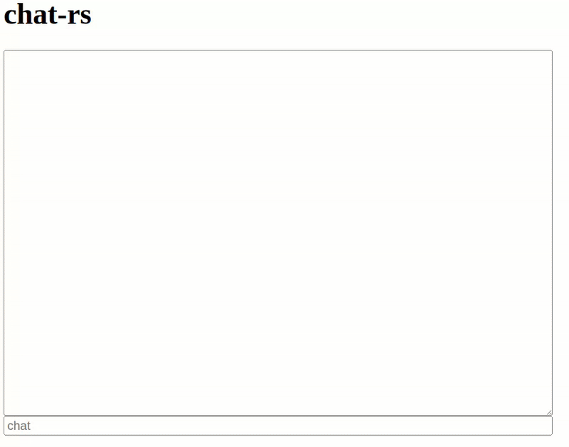

# chat-rs
LLM model serving from scratch in pure Rust. Made with tonic, axum, candle.rs, and ❤️

Currently in active development so expect this doc to be updated regularly!

# demo


# running
Currently there are 2 main services; a tonic-based gRPC server which hosts the model running inference ([Qwen2.5-0.5B-Instruct](https://huggingface.co/Qwen/Qwen2.5-0.5B-Instruct)) and an axum-based web server hosting the very basic chat.html.

Before running these services though we need to connect to some db instances. This is done by running

```bash
./scripts/postgres.sh && ./scripts/redis.sh
```

Those scripts will spin up some Docker containers for our Postgres and Redis instances, respectively.

To get the server up and running execute in one terminal the command below (n.b. the `--release` is necessary to get performance out of our locally running LLM):
```bash

cargo run --bin server --release
```


And in another terminal run 

```bash 
cargo run --bin web
```
